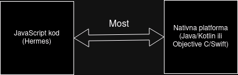

# Gymarius - Asistent za teretanu
**Gymarius** je aplikacija izrađena u ReactNative razvojnom okviru koja olakšava praćenje Vašeg napretke u teretani ili drugim sportskim aktivnostima. U aplikaciji možete zapisati Vaše treninge i time pratiti napredak u teretani na određenim vježbama ili organizirati si trening, a aplikacija će uzeti te podatke i prikazati Vam ih u pregledom i lijepom formatu s grafovima. Također aplikacija nudi chatbot s kojim možete pričati o svim pitanjima koja imate vezano uz teretanu bilo to koje vježbe raditi za određenu skupinu mišića, kako pravilnije raditi neke vježbe ili nešto potpuno treće. Aplikacija je izrađena u sklopu završnog rada na [FER-u](https://www.fer.unizg.hr) uz mentorstvo doc. dr. sc. Luke Humskog ([službena stranica](https://www.fer.unizg.hr/luka.humski)).

### Sadržaj
- [Tehnologije](#tehnologije)
- [Pokretanje razvojnog okruženja](#pokretanje)

## Tehnologije
#### ReactNative
ReactNative je razvojni okvir koji razvija Meta, a omogućuje pisanje koda aplikacije u JavaScriptu koji može pristupiti nativnim komponentama sustava i tako pruža mogućnost pisanja pravih nativnih aplikacija u JavaScriptu. To je različit pristup od drugih okvira poput Google-ovog Flutter-a. ReactNative aplikacije funkcioniraju tako da JavaScript kod koji se izvršava u posebnoj dretvi komunicira preko mosta sa nativinim kodom koji se izvršava u svojoj posebnom dretvi. Ta komunikacija je asinkrona i zasnova na događajima. JavaScript kod se izvršava pomoću posebnog JIT prevoditelja Hermes koji je napisan specifično za ReactNative od strane ReactNative tima. (**Napomena:** arhitektura ReactNative aplikacija se mijenja i više neće funkcionirati na ovaj način, ali ova aplikacija je izrađena po ovoj staroj arhitekturi.)

<figure>
    
    <figcaption>Prikaz arhitekture ReactNative-a</figcaption>
</figure>

Službena stranica nalazi se [ovdje](https://reactnative.dev/).

#### Expo
Expo je set alata koji nadograđuju ReactNative i olakšavaju rad s ReactNative-om tako da dodaje integracije s raznim nativnim komponentama poput kamere ili obavijesti, olakšava objavu aplikacije na Google Play-u ili Apple App Store-u i omogućava brži razvoj zbog mogućnosti kao što je *hot realoading*. Također Expo omogućava lagani izlazak iz njegovog ekosustava ako je potrebna nativna funkcionalnost koja nije još podržana tako da u moderno vrijeme nema previše razloga zašto ne koristiti Expo. Više o Expu može se pročitati na službenim stranicama [ovdje](https://expo.dev/).

#### OpenAI API
OpenAI je 2022 revolucionarizirao svijet umjetne inteligencije kada je pokazao ChatGPT. Ova aplikacija pokušava iskoristit dio mogućnosti GPT modela preko API-a koji nudi OpenAI kako bi pokretala svoju chatbot funkcionalnost. Taj API omogućava direktnu komunikaciju s GPT modelom preko JSON sučelja i time aplikacija može izraditi funkcionalnost chatbota bez puno muke.

<a id="pokretanje" />

## Pokretanje razvojnog okruženja
Kako bi se pokrenulo razvojno okruženje potrebno je slijediti sljedeće korake.
Klonirajte ovaj repozitorij.
```bash
git clone 
```


